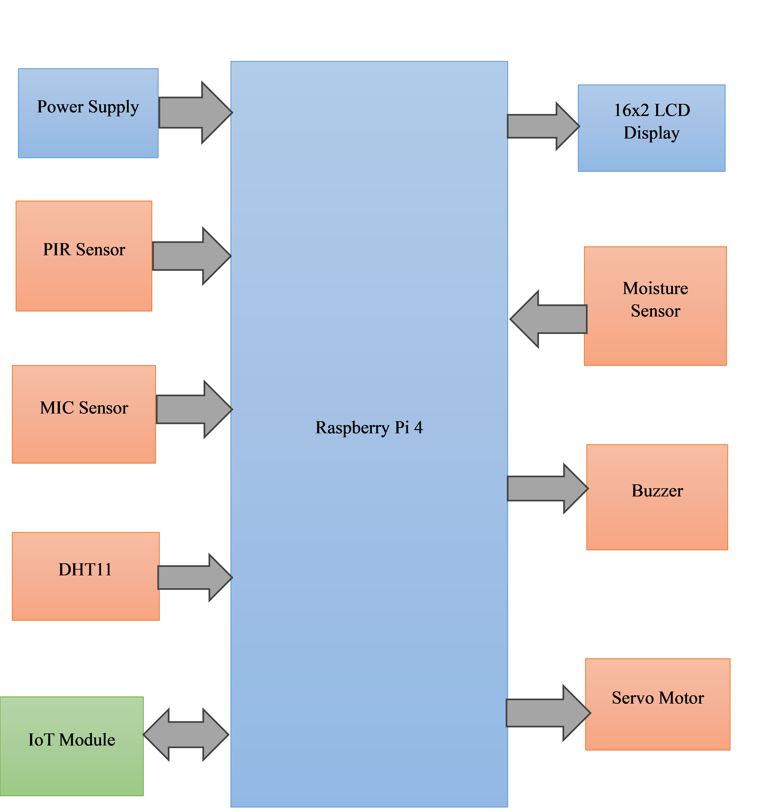
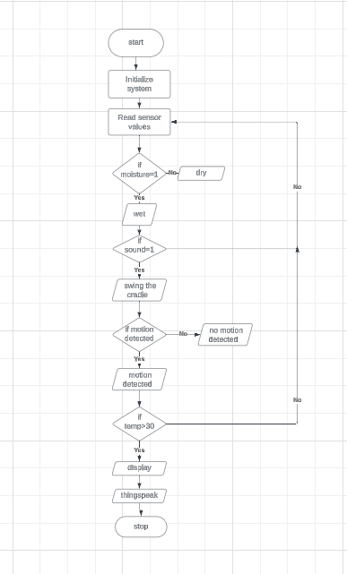
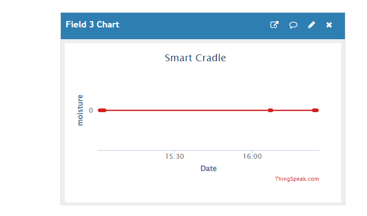

# Smart Cradle — Raspberry Pi Baby Monitoring System

An automated baby monitoring and soothing system built on a Raspberry Pi 4. It tracks temperature, humidity, moisture, motion, and sound around an infant, automatically rocks the cradle when the baby cries, displays live status on an LCD, and sends data to the cloud for remote monitoring.

## Overview

Smart Cradle combines multiple sensors with a Raspberry Pi 4 to reduce the manual effort of baby monitoring. It detects wetness (diaper/bedding), monitors ambient temperature and humidity, listens for crying, and automatically swings the cradle via a servo motor to soothe the baby — while pushing all readings to ThingSpeak for remote/caregiver visibility.

## Hardware Components

| Component | Purpose |
|---|---|
| Raspberry Pi 4 | Main processing unit — reads all sensors, controls actuators, manages Wi-Fi/IoT connectivity |
| DHT11 Sensor | Measures ambient temperature and humidity |
| Moisture Sensor | Detects wetness (diaper/bedding) |
| PIR Sensor | Detects motion/presence near the crib |
| MIC (Sound) Sensor | Detects crying/sound levels |
| 16x2 LCD Display | Shows live sensor status on-device |
| Buzzer | Local audible alert |
| Servo Motor | Physically swings/rocks the cradle |
| IoT Module | Sends sensor data to the cloud (ThingSpeak) |
| Power Supply | Powers the Raspberry Pi and peripherals |

## System Architecture

The Raspberry Pi 4 sits at the center, reading inputs from the PIR, MIC, DHT11, and moisture sensors, and driving outputs to the LCD, buzzer, and servo motor. An IoT module handles two-way communication with the cloud for remote data logging.

## How It Works

The system follows this control logic:

1. **Initialize** the system and begin reading sensor values in a loop.
2. **Moisture check** — if the moisture sensor reads wet, this is flagged (otherwise flagged dry).
3. **Sound check** — if crying/sound is detected, the servo motor swings the cradle to soothe the baby.
4. **Motion check** — the PIR sensor flags whether motion was detected.
5. **Temperature check** — if temperature exceeds 30°C, this is flagged as a condition needing attention.
6. **Display & log** — the current status is shown on the 16x2 LCD and pushed to ThingSpeak.
7. The loop repeats continuously, so caregivers always have live, current status both on-device and remotely.

## Software & Tools

- Python (GPIO sensor reading, servo control, and data processing on Raspberry Pi)
- Raspberry Pi OS
- ThingSpeak (IoT cloud platform for data logging, visualization, and notifications)
- RPi.GPIO / Adafruit_DHT (or equivalent sensor libraries)

## Setup Instructions

1. Connect the DHT11, moisture sensor, PIR sensor, MIC sensor, LCD, buzzer, and servo motor to the Raspberry Pi's GPIO pins as per the block diagram.
2. Install required Python libraries (e.g. `pip install Adafruit_DHT RPi.GPIO requests`).
3. Create a ThingSpeak account and set up a channel with fields for temperature, humidity, and moisture (and additional fields for motion/sound if desired).
4. Update the Python script with your Wi-Fi credentials and ThingSpeak Write API Key.
5. Run the script on the Raspberry Pi (optionally set it up to run on boot using a systemd service or cron job).
6. Monitor live LCD status locally and view historical trends on the ThingSpeak dashboard.

## Results

**Temperature & Humidity over time:**

**Moisture readings over time:**

Across the test run, temperature and humidity tracked ambient room conditions consistently, and the moisture sensor correctly held at a steady baseline (0) with no false positives during dry conditions.

## Future Improvements

- Add a live camera feed for visual monitoring alongside sensor data
- Add mobile push notifications instead of/alongside ThingSpeak alerts
- Log historical data to a local database for offline access history
- Add adjustable cradle-swing intensity/duration based on how long crying persists

## License

This project is open-source and available under the MIT License.
