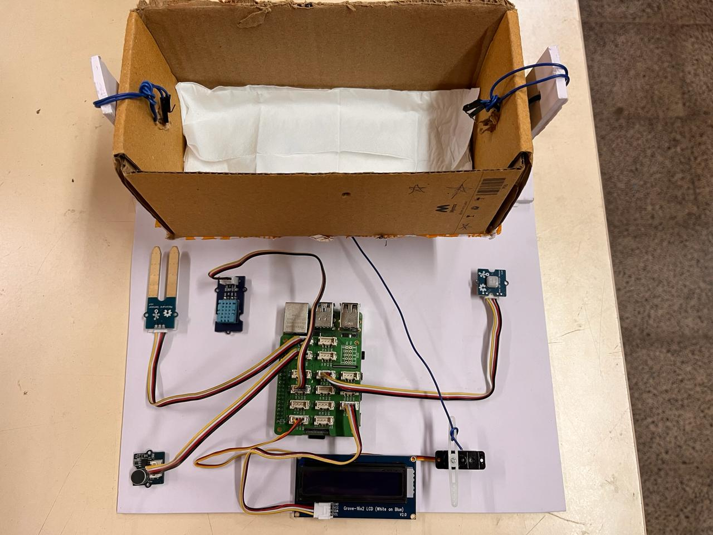
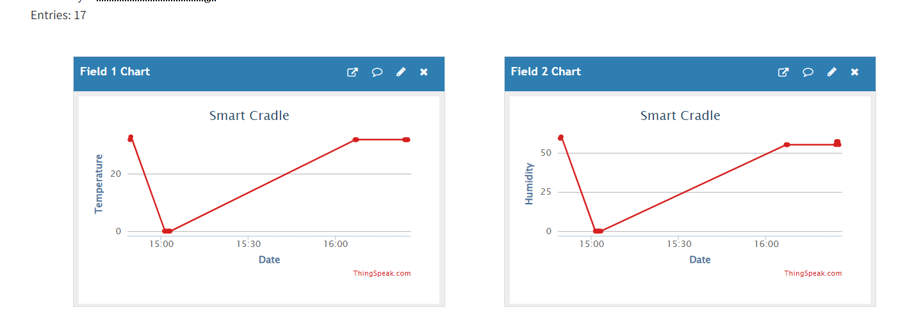

# IOT BASED ADVANCED SMART CRADLE FOR BABY MONITORING SYSTEM

An automated baby monitoring and soothing system built on a Raspberry Pi with a **Grove Base Hat**. It tracks temperature, humidity, moisture, motion, and sound around an infant, automatically rocks the cradle when the baby cries, displays live status on an LCD, and sends data to the cloud for remote monitoring.

## Overview

Smart Cradle combines a set of Grove-ecosystem sensors with a Raspberry Pi to reduce the manual effort of baby monitoring. It detects wetness (diaper/bedding), monitors ambient temperature and humidity, listens for crying, and automatically swings the cradle via a servo motor to soothe the baby — while pushing all readings to ThingSpeak for remote/caregiver visibility. Using Grove modules (rather than bare sensors wired directly to GPIO) kept the build modular and easy to reconfigure — each sensor plugs into the Base Hat via a standardized 4-pin connector, so swapping or repositioning a sensor didn't require any rewiring or soldering.

## Hardware Components

| Component | Purpose |
|---|---|
| Raspberry Pi + Grove Base Hat | Main processing unit — reads all Grove sensors, controls actuators, manages Wi-Fi/IoT connectivity |
| Grove Temperature & Humidity Sensor (DHT11) | Measures ambient temperature and humidity |
| Grove Moisture Sensor | Detects wetness (diaper/bedding) via analog probe |
| Grove PIR Motion Sensor | Detects motion/presence near the crib |
| Grove Sound Sensor (MIC) | Detects crying/sound levels via analog microphone |
| Grove 16x2 LCD (White on Blue) | Shows live sensor status on-device over I2C |
| Servo Motor | Physically swings/rocks the cradle |
| Power Supply | Powers the Raspberry Pi and peripherals |

**Prototype build:** the electronics sit outside a small cardboard cradle mockup with a servo arm connected for the rocking motion — see the photo below.

## System Architecture

The Raspberry Pi sits at the center, reading inputs from the Grove PIR, sound, DHT11, and moisture sensors via the Grove Base Hat's digital and analog slots, and driving outputs to the Grove LCD and servo motor. The Pi's own Wi-Fi handles communication with ThingSpeak for remote data logging.

## How It Works

The system follows this control logic:

1. **Initialize** the system and begin reading sensor values in a loop.
2. **Moisture check** — if the moisture sensor reads wet, this is flagged (otherwise flagged dry).
3. **Sound check** — if crying/sound is detected, the servo motor swings the cradle to soothe the baby.
4. **Motion check** — the PIR sensor flags whether motion was detected.
5. **Temperature check** — if temperature exceeds 30°C, this is flagged as a condition needing attention.
6. **Display & log** — the current status is shown on the 16x2 LCD and pushed to ThingSpeak.
7. The loop repeats continuously, so caregivers always have live, current status both on-device and remotely.

## Software & Tools

- Python 3
- Raspberry Pi OS
- [grove.py](https://github.com/Seeed-Studio/grove.py) — Seeed's official Python library for Grove sensors on the Grove Base Hat
- RPi.GPIO (for direct servo PWM control)
- ThingSpeak (IoT cloud platform for data logging, visualization, and notifications)

## Setup Instructions

1. Plug the Grove Moisture Sensor, Grove DHT11, Grove PIR sensor, Grove Sound Sensor, and Grove 16x2 LCD into their respective analog/digital/I2C slots on the Grove Base Hat, and connect the servo motor to a PWM-capable slot.
2. Install the Grove library: `curl -sL https://github.com/Seeed-Studio/grove.py/raw/master/install.sh | sudo bash -s -`
3. Run `grove_gpio` in the terminal to confirm which BCM pin number corresponds to each slot you used, and update the pin numbers in the code accordingly.
4. Install remaining Python dependencies: `pip3 install requests`.
5. Create a ThingSpeak account and set up a channel with fields for temperature, humidity, and moisture (and additional fields for motion/sound if desired).
6. Update the Python script with your ThingSpeak Write API Key.
7. Run the script on the Raspberry Pi (optionally set it up to run on boot using a systemd service or cron job).
8. Monitor live LCD status locally and view historical trends on the ThingSpeak dashboard.

## Results

**Temperature & Humidity over time:**

**Moisture readings over time:**

Across the test run, temperature and humidity tracked ambient room conditions consistently, and the moisture sensor correctly held at a steady baseline (0) with no false positives during dry conditions.

## Future Improvements

- Add a live camera feed for visual monitoring alongside sensor data
- Add mobile push notifications instead of/alongside ThingSpeak alerts
- Log historical data to a local database for offline access history
- Add adjustable cradle-swing intensity/duration based on how long crying persists

## License

This project is open-source and available under the MIT License.
